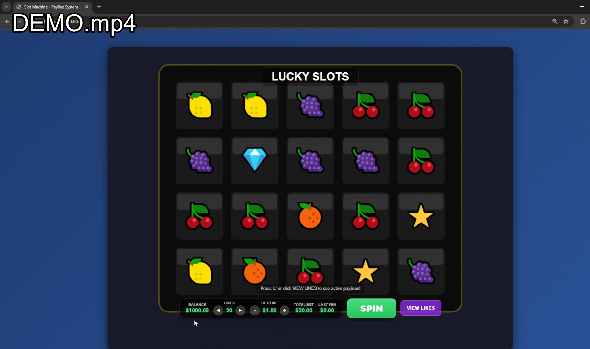

# Lucky Slots - PixiJS Slot Machine Game

A fully functional slot machine game built with PixiJS, featuring mathematically generated paylines, weighted random symbol generation, and smooth animations.

## Video Demo

[](DEMO.mp4)

## Features

- **5 reels × 4 rows** grid layout with 60 fps animation
- **100 mathematically generated paylines** (selectable: 20, 40, or 100 lines)
- **Weighted random system** for realistic symbol probabilities
- **Object pooling** for performance optimization
- **Responsive design** with automatic viewport scaling
- **Win animations** with particle effects
- **Keyboard controls** (Space, Arrow keys, L key for paylines)

## Tech Stack

- **Vanilla JavaScript (ES6 modules)** - No frameworks
- **PixiJS 7.3.2** - WebGL rendering engine
- **No build tools** - Runs directly in browser
- **Organized class structure** - Separation of concerns

## Project Structure

```
interactive-slot-game/
	index.html                    # Main game page
	test.html                     # Symbol analyzer testing
	src/
		core/
			Game.js              # Main game logic & state
		components/
			Reel.js              # Individual reel with object pooling
			Symbol.js            # Symbol rendering and animations
			PaylineOverlay.js    # Visual payline display
			WinPresentation.js   # Win effects and particles
		math/
			GameMath.js          # Weighted random and win calculation
		utils/
			Config.js            # Game configuration and payline generation
		managers/
			AnimationManager.js  # Animation system
			AudioManager.js      # Audio system (structure only)
		SymbolAnalyzer.js        # Symbol counting utility
```

## How to Run

1. Clone the repository:
```bash
git clone https://github.com/Buhuihanguoren/interactive-slot-game.git
cd interactive-slot-game
```

2. Start a local server:
```bash
python -m http.server
```

3. Open browser to `http://localhost:8000`

**Requirements:** 
- Modern browser with ES6 module support (Tested on Chrome, Brave.)
- Make sure that your browser has Hardware Acceleration ON!
- Minimum window size: 900×700 pixels

## Key Concepts

### Object Pooling
Instead of creating and destroying symbols on each spin (which causes performance issues and randomly generates new emojis on last frame), each reel maintains 11 symbol objects (3 visible + 8 buffer). Symbols are reused by changing their values.

### Weighted Random Generation
Symbols have different probabilities of appearing:
```javascript
Cherry (🍒): 25/100 odds
Lemon (🍋):  25/100 odds
Diamond (💎): 8/100 odds
Seven (7️⃣):   2/100 odds
```
This creates realistic slot machine behavior where rare symbols (7️⃣) pay more but appear less frequently.

### Mathematical Payline Generation
Rather than hardcoding 100 payline patterns, the system generates them algorithmically using:
- Horizontal lines
- Diagonal patterns
- V-shapes and zigzags
- Wave patterns (sine-based)
- Step patterns
- Random valid patterns

## Game Controls

- **Space** or **Click SPIN** - Spin the reels / Stop early
- **Arrow Up/Down** - Change number of active lines
- **Arrow Left/Right** - Adjust bet per line
- **L key** or **VIEW LINES button** - Toggle payline display

## What I Learned

- **PixiJS fundamentals**: Working with containers, graphics, sprites, and the game loop
- **Object-oriented design**: Organizing code into reusable, maintainable classes
- **State machines**: Managing reel states
- **Performance optimization**: Understanding why object pooling for smooth animations
- **Array manipulation**: Working with nested arrays (2D grid of symbols)
- **ES6 modules**: Proper import/export structure without build tools

## Future Improvements

- Add actual sound effects (AudioManager structure is ready)
- Implement progressive jackpot feature
- Add more symbol types and special symbols (Wilds, Scatters)
- Add autoplay functionality
- Implement save/load game state with localStorage
- Add animation presets for different win sizes
## Demo

[Watch the demo](DEMO.mp4)

